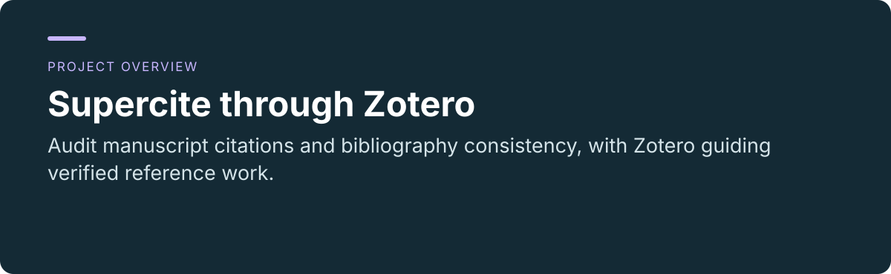
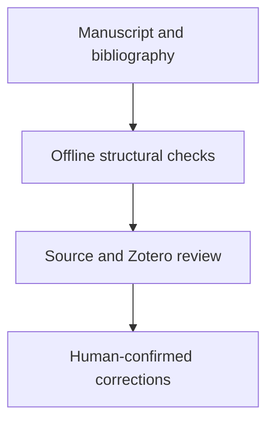

<p align="center"></p>

<p align="center"><a href="README.md"></a> <a href="README.zh-CN.md"></a></p>

# Supercite through Zotero

**Audit manuscript citations and bibliography consistency, with Zotero guiding verified reference work.**

[Project usage and maintenance](../README.md) · [Report an issue](https://github.com/thejaytang/supercite-through-zotero/issues)

## 1. What you can do

- Find missing cite keys and unused bibliography entries with offline scripts.
- Keep source-support review and confirmed Zotero changes separate from structural checks.

### Actual script output

The [fictional manuscript](../examples/paper.tex) cites `demo-present` and `demo-missing`. Its [bibliography](../examples/references.bib) contains the former and an uncited `demo-unused` entry.

The [actual report](../examples/audit-report.md) finds one missing key and one unused key. The fictional entries test structure; they do not establish source existence or claim support.

## 2. Start here

Install the skill from [its directory](../skills/supercite-through-zotero). The fictional sample can be checked offline:

```bash
python3 skills/supercite-through-zotero/scripts/summarize_reference_audit.py examples/paper.tex --bib examples/references.bib
```

## 3. Use cases

These are illustrative scenarios. Only explicitly linked execution artifacts represent checks performed for this update.

| Input or request | Expected result |
|---|---|
| A LaTeX draft and bibliography | Missing and unused cite keys to review |
| A dense citation cluster | A placement audit and requests for source evidence |
| Unresolved reference metadata | A Zotero lookup or import plan for confirmation |



## 4. Requirements and current limits

Bundled Python scripts perform offline structural checks. A compatible agent and a separate Zotero integration are needed for library operations. Finding a matching record does not prove that it supports a claim. Imports and record changes require user authorization. Word and Google Docs field citations remain the responsibility of their Zotero integration.

## 5. Documentation and sources

These links identify the implementation, operating instructions or related projects for a closer fit check.

- [Install and usage](../README.md)
- [Skill instructions](../skills/supercite-through-zotero/SKILL.md)
- [Actual sample report](../examples/audit-report.md)

## 6. License and maintenance

See the root [LICENSE](../LICENSE) for terms and attribution. Third-party materials retain their own terms.

This is the public introduction. Linked project documents remain authoritative for operation, constraints and maintenance. Presentation updated: 2026-09-22.
