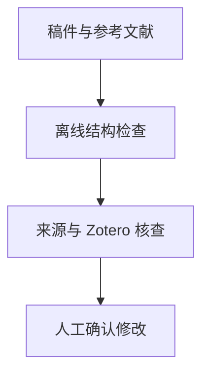

<p align="center"></p>

<p align="center"><a href="README.md"></a> <a href="README.zh-CN.md"></a></p>

# Supercite through Zotero

**审查稿件引用与参考文献一致性，并通过 Zotero 组织经过核查的文献处理。**

[项目使用与维护入口](../README.md) · [报告问题](https://github.com/thejaytang/supercite-through-zotero/issues)

## 1. 能完成什么

- 使用离线脚本找出缺失引用键和未引用文献条目。
- 将来源支持核查、明确授权的 Zotero 修改与结构检查区分开。

### 实际脚本输出

[虚构稿件](../examples/paper.tex)引用 `demo-present` 和 `demo-missing`；[示例文献库](../examples/references.bib)只有前者及未引用的 `demo-unused`。

[实际报告](../examples/audit-report.md)检出一个缺失键和一个未使用键。虚构条目只用于结构检查，不证明来源存在或支持论断。

## 2. 从这里开始

从[技能目录](../skills/supercite-through-zotero)安装。下面的虚构示例可以离线检查：

```bash
python3 skills/supercite-through-zotero/scripts/summarize_reference_audit.py examples/paper.tex --bib examples/references.bib
```

## 3. 使用场景

以下为说明性场景；只有明确链接的运行产物才代表本次检查结果。

| 输入或请求 | 预期结果 |
|---|---|
| LaTeX 稿件与文献库 | 需要复查的缺失与未使用引用键 |
| 密集的引用簇 | 引用位置审查及所需来源证据 |
| 未解决的参考文献元数据 | 待确认的 Zotero 检索或导入计划 |



## 4. 使用条件与当前边界

内置 Python 脚本执行离线结构检查。操作文献库需要兼容 Agent 与另行提供的 Zotero 集成。匹配到文献记录不证明它支持正文论断。导入和记录修改需要用户授权。Word 与 Google Docs 的字段引用仍由对应 Zotero 集成处理。

## 5. 资料与来源

下面链接指向实现、操作说明或相关项目，便于进一步判断适用性。

- [安装与使用](../README.md)
- [技能指令](../skills/supercite-through-zotero/SKILL.md)
- [实际示例报告](../examples/audit-report.md)

## 6. 许可与维护

许可与归属以根目录 [LICENSE](../LICENSE) 为准；第三方材料保留其原有条款。

本页为对外介绍。具体操作、约束和维护说明以链接的项目文档为准。展示页更新：2026-09-22。
